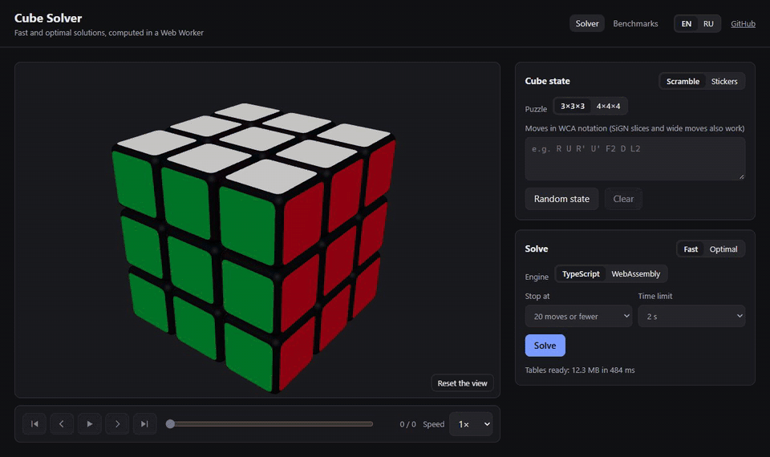
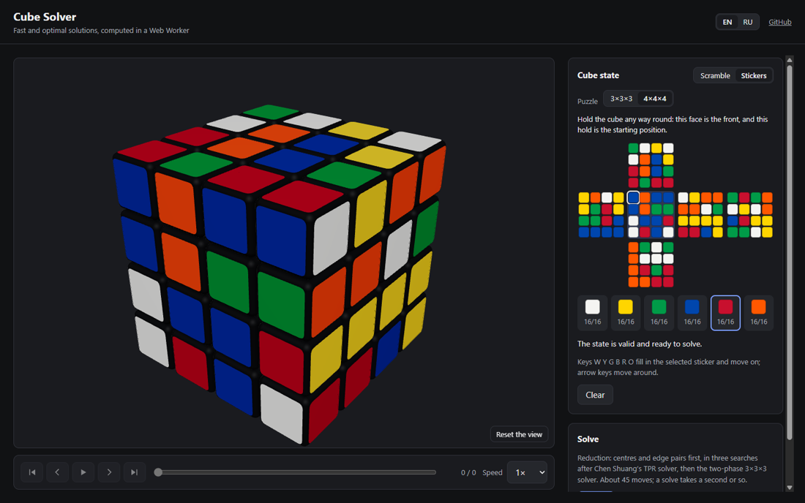
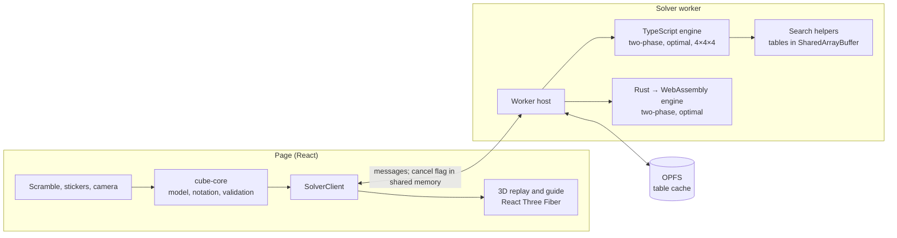

# cube-solver

A Rubik's cube solver for the 3×3×3 and the 4×4×4 that runs entirely in the browser and is made
to be used with a real cube: describe the cube by a scramble, by its stickers or with the camera,
get a solution, and follow it move by move, with arrows on a 3D cube and plain instructions such
as "turn the right face so the front goes up".

**Demo:** <https://cube.mrdenzzz.ru>, deployed from `main` on every green CI run
([docs/deploy.md](docs/deploy.md)). English and Russian.



## What it does

- **3×3×3, fast:** Kociemba's two-phase algorithm. Solutions of at most 20 moves, 19.7 on
  average, in milliseconds: the median is 5.6 ms on a desktop.
- **3×3×3, optimal:** IDA\* with Michael Reid's three-axis bound and symmetry-reduced tables,
  which proves that no shorter solution exists. Tables are built in the browser and cached in
  OPFS; the search runs on every core, with the tables in shared memory. With the large table the
  nodes searched at each depth match those Kociemba publishes for his optimal solver.
- **Two engines:** the 3×3×3 solvers exist in TypeScript and in Rust compiled to WebAssembly,
  with byte-identical tables, switchable in the page. Per thread WebAssembly is 1.8 times as
  fast; the TypeScript engine has threads.
- **4×4×4:** reduction to a 3×3×3 in three phases after Chen Shuang's TPR solver, with an exact
  edge-pairing table, finished by the two-phase solver: 45 moves on average in about 0.6 s.
- **Input:** WCA and SiGN notation, with errors pointed out by position; a sticker editor with
  keyboard entry and validation that highlights impossible pieces; a camera scan where you just
  turn the cube in front of the camera: faces are taken by themselves in any order and any way
  up, the colours are named with CIEDE2000 and the pictures placed on the cube by a search.
- **Guide:** how to hold the cube (on the 4×4×4, by naming the corner at the top front right),
  which layer to turn and which way, an arrow on the 3D cube, and the screen kept awake while
  you follow it.
- **Benchmarks page:** run the solvers on your own device and compare with recorded numbers.



## How it fits together



- The page never searches: a worker builds the tables and answers requests, reporting progress.
  Cancelling sets a flag in shared memory that the search polls, so a cancelled optimal search
  keeps its tables. That needs cross-origin isolation, which the server provides with COOP and
  COEP headers.
- Every solution is applied to the cube and checked before it is shown, in the solvers, in the
  tests and in the benchmarks.

## Benchmarks

AMD Ryzen 7 9800X3D, Node 24, raw results in [tools/bench/results](tools/bench/results); the
[benchmarks page](https://cube.mrdenzzz.ru/#/bench) runs the same seeded cubes on your device.

| Solver                            | Cubes | Mean length | Median | p95    | Slowest |
| --------------------------------- | ----- | ----------- | ------ | ------ | ------- |
| 3×3×3 two-phase, stop at ≤ 21     | 1000  | 20.12       | 5.2 ms | 23 ms  | 140 ms  |
| 3×3×3 two-phase, stop at ≤ 20     | 1000  | 19.73       | 5.6 ms | 145 ms | 2.6 s   |
| 4×4×4 reduction, default settings | 200   | 45.19       | 621 ms | 1.4 s  | 2.0 s   |

Optimal search, Kociemba's ten random positions, every length through 16 (the same nodes in every
run):

| Engine      | Threads | Table, 35 MB     | Table, 0.9 GB   |
| ----------- | ------- | ---------------- | --------------- |
| TypeScript  | 1       | 106 s, 18.2 M/s  | 48 s, 5.0 M/s   |
| WebAssembly | 1       | 58 s, 33.2 M/s   | 27 s, 8.9 M/s   |
| TypeScript  | 16      | 9.2 s, 211.5 M/s | 3.6 s, 67.2 M/s |

## Decisions

Each choice with alternatives and measurements is an [architecture decision record](docs/adr):

1. [Cube state representation](docs/adr/0001-cube-state-representation.md)
2. [Two-phase pruning tables and search](docs/adr/0002-two-phase-tables-and-search.md)
3. [Solver worker: protocol, progress and cancellation](docs/adr/0003-solver-worker-protocol.md)
4. [Optimal tables: built in the browser, cached in OPFS](docs/adr/0004-table-storage.md)
5. [Optimal solver: Reid's three-axis bound with symmetry-reduced tables](docs/adr/0005-optimal-solver.md)
6. [Rust to WebAssembly toolchain](docs/adr/0006-rust-to-webassembly-toolchain.md)
7. [TypeScript vs WebAssembly, and threads](docs/adr/0007-typescript-vs-webassembly.md)
8. [4×4×4: three-phase reduction with an exact edge-pairing table](docs/adr/0008-four-by-four-reduction.md)
9. [Camera input: faces in any order, CIEDE2000, balanced groups and a placement search](docs/adr/0009-camera-input.md)
10. [Hosting: nginx on our own server, for cross-origin isolation](docs/adr/0010-hosting.md)

Research done before the first line of code, with sources: [docs/research.md](docs/research.md).

## Limitations

- The 4×4×4 solver exists in TypeScript only. Its solutions are about 0.8 moves longer than TPR's
  published average, which keeps more candidates.
- An optimal solve takes from seconds to many minutes; the 0.9 GB table is for desktops.
- The WebAssembly engine searches on one thread: Rust's WebAssembly threads still need a nightly
  toolchain.
- Colour classification is tested on synthetic pictures, not yet across real cameras and lights.
  The editor shows the result for checking, and there is no photo upload for devices without a
  camera.
- On a phone the 4×4×4 sticker net is small (about 16 px a sticker); the camera is the better way
  in there.
- Without cross-origin isolation (another host, or an old browser) cancelling restarts the worker
  and the optimal search runs on one thread.

## Repository layout

| Path                        | Purpose                                                               |
| --------------------------- | --------------------------------------------------------------------- |
| `apps/web`                  | Vite + React app: 3D cube, input, guide, camera, benchmarks page; e2e |
| `packages/cube-core`        | Cube models (3×3×3 cubies, 4×4×4 pieces), moves, notation, validation |
| `packages/solver-contracts` | The engine interface and the worker message protocol                  |
| `packages/solver-ts`        | Solvers in TypeScript: two-phase, optimal (threaded), 4×4×4 reduction |
| `packages/solver-wasm`      | The 3×3×3 solvers in Rust (`crates/`), compiled to WebAssembly        |
| `tools/bench`               | CLI benchmarks over fixed seeded cubes; JSON results                  |
| `tools/tablegen`            | Offline optimal-table generation for the benchmarks                   |
| `docs`                      | ADRs, research notes, deployment                                      |

## Development

Requirements:

- Node.js 24 and pnpm (the version is pinned in `packageManager`)
- Rust toolchain from `rust-toolchain.toml` (rustup installs it on first use)
- wasm-bindgen CLI matching the crate version:
  `cargo install wasm-bindgen-cli --version 0.2.129 --locked`
- Google Chrome for the end-to-end tests

```sh
pnpm install
pnpm check                    # lint, typecheck, test and build (including WASM) via Turborepo
pnpm turbo run dev --filter=@cube/web...   # dev server plus watch builds of its dependencies
pnpm --filter @cube/web e2e   # Playwright against the build, desktop and phone viewports
cargo test --workspace        # Rust unit tests
pnpm --filter @cube/bench bench --count 1000      # see tools/bench for every benchmark
```

Commits follow [Conventional Commits](https://www.conventionalcommits.org/); a `commit-msg`
hook checks them with commitlint.

## License

[MIT](LICENSE)
